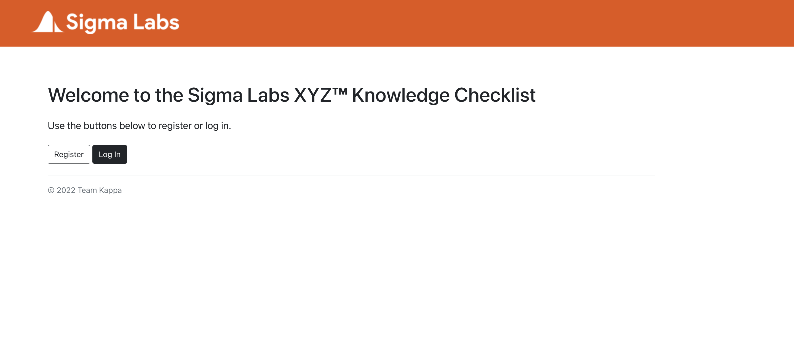
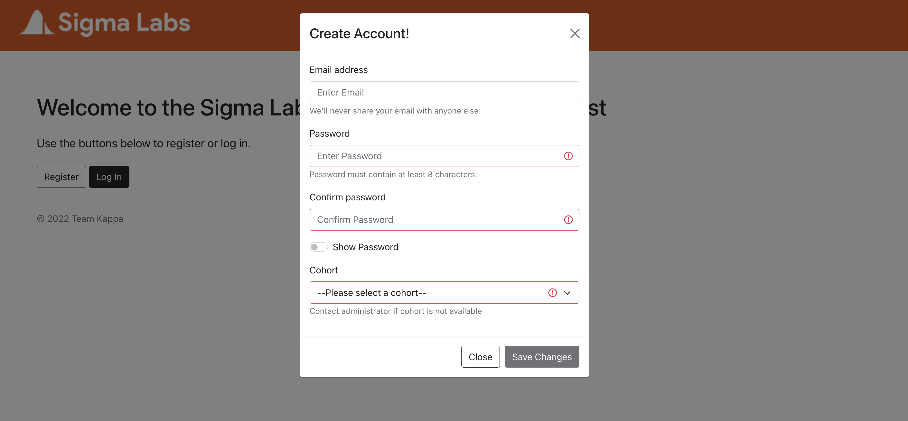
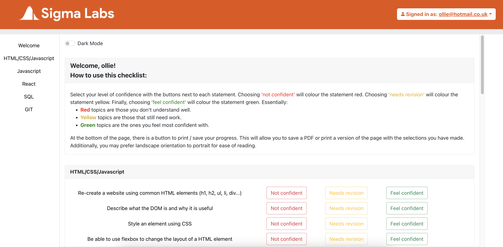
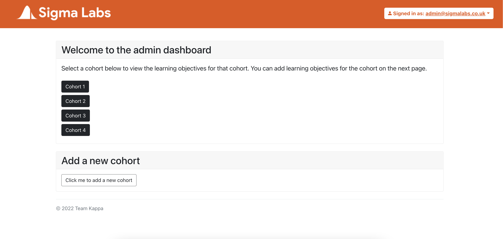
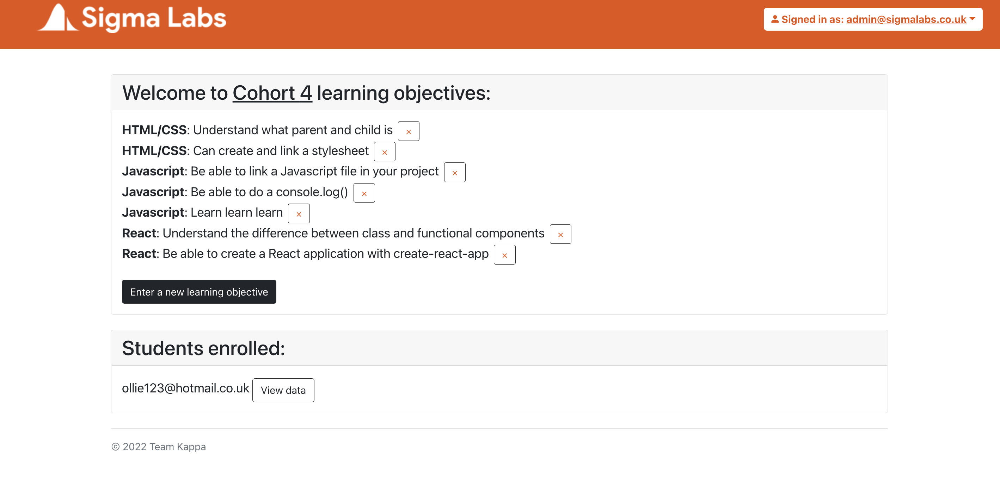

# KnowledgeChecklistFrontend

## Welcome to Our Project!


## Table of Contents

- [Introduction](#introduction)
- [Technologies](#technologies)
- [Setup](#setup)

## Introduction

This project contains the knowledge checklist application for students at Sigma Labs. The aims of this project include:

- Providing students with a means of evaluating their current knowledge and understanding of the 12-week fullstack development curriculum.
- Providing students with resources should they require further study or assistance in a subject area.
- Providing students with assessment materials if they confident enough in a subject area.
- Providing coaches with a means of viewing the progress of an individual student.
- Providing coaches with a high-level overview of how students in a given cohort, as a means of generating feedback for the teaching performance of coaches.

## Student Overview

When a student first visits the website, they are brought to the landing page, which contains a welcome message as well as two buttons; one to register and one to login.



Before a student can access the website, they must register with a valid email address and password (which meets requirements). If the registration is successful, the user will receive a notification on the form. They can now login with these credentials.



Upon login, they are directed to the student dashboard. This page contains a welcome section, progress bar, side navigation bar as well as the learning objectives under each topic. Within each learning objective, three buttons can be found side-by-side. These buttons related to the level of confidence that each trainee has with respect to that learning objective.



To find a specific LO, a side navigation bar is provided to the students to quickly navigate through the page. Clicking a button submits a 'score' which stores the level of confidence of that LO. Clicking a button will also change the colour to the same colour as the button to indicate their level of confidence. If the student reloads the page, or returns to the student dashboard at a later time, they will see their previously submitted and saved LOs.

## Admin Overview

When the admin logs in, they are able to view the cohorts and add a new one if necessary.



They can also view the learning objectives for each cohort, add a new learning objective and view the students on each cohort as well as each students responses.



## Technologies

This project has been created with:

- yarn version: 1.22.17
- react version: 17.0.2
- react-bootstrap version: 2.1.2
- react-router-dom version: 5.2.0
- react-cookie version: 4.1.1
- react-dom version: 17.0.2

## Setup

To run locally, first fork and clone this repository. Then, in the command line, enter the following commands:

```
$ cd ../knowledge-challenge-app
$ yarn install
$ yarn start
```

As well as this. the related backend Server will also be required in order for the App to function properly. The backend repository for this project can be found [here](https://github.com/olliecase-green/KnowledgeChecklistBackend). We recommend cloning both repositories to your local machine for ease of access.

## License

The license for this software can be accessed [here](LICENSE.md)

## Developers

The Developers that worked on this project are:

Project Manager & Engineer: [Fahmidul Haque](https://github.com/FahmidulHaquee)
System Architect & Engineer: [Oliver-case Green](https://github.com/olliecase-green)
Quality Assurance & Engineer: [Zayn Shah](https://github.com/zaynshah)
